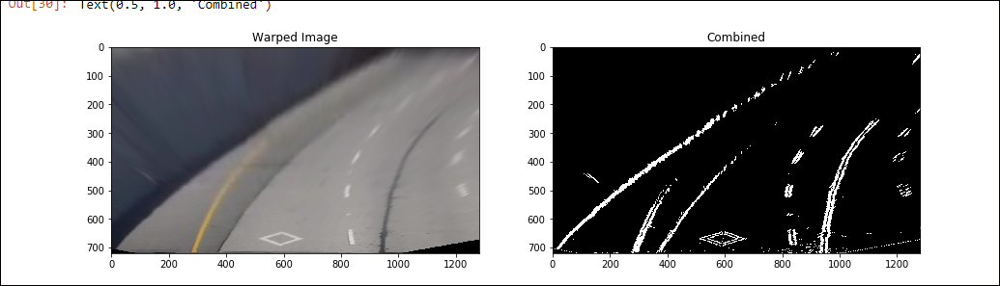

## Advanced Lane Finding
The python notebook in the repo has all the necessary documentation and comments. Presented below is the progress and also discussion about the final output.

### Progress
*initial commit with camera matrix code*
 - Draw chess corners and get the camera matrix
 - output the chesscorners on one image
 - 

*Added src and dst points*
 - Tuned the src and dst points 
 - Printed out on a curved and straight line. Looks decent
 - cleaned up the warped image implementation
 - 

*Straight lines in the image output*
 - Added the sobel and color transform
 - wrapped and applied transforms
 - Checked the output of image after transforms
 - straight lines coming out
 - 

*Added histogram function*
 - Added histgram function and output it
 - 

*line find and fit polynomial functions*
 - Added sliding window function and visualized outputs
 - fit lines to them
 - 

*unwrap and draw lines*
 - Unrwap the image and draw the lines on them
 - fill the ploygon area for visualization
 - 

*add pipeline*
 - Complete the pipeline 
 - Output of pipeline in the ./output_images folder
 - Video uploaded onto imgur

### Output Notes
*Project video output* :https://imgur.com/a/AgkYAH3
* The pipeline runs smoothly on this road even on the parts where there is a bridge (sharp change of color and contrast with the lane lines). A clear marking of the lanes is very helpful and also the fact that there are no sharp turns. It also tracks the roads where there are sharp shadows from the trees and objects nearby

*Challenge Video Output* : https://imgur.com/a/9E7ZDvC
* As can be seen, while the lane lines to the corners are tracked properly, the inner lines are a bit wobbly because of the tyre marks on the road. The pipeline gets most of the road decent, but the places where the lane line and the tyre marks start deviating, we see discrepency.
* Below image shows the area where the pipeline doesnt work completely. As can be seen, this image has a lot going on with the pavement line, tyre marks and shadows. These kind of areas are where the pipeline shorts fall off a smooth tracking.

