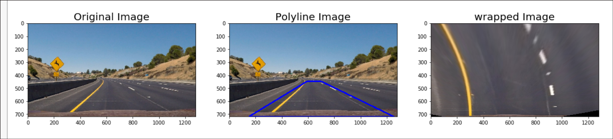
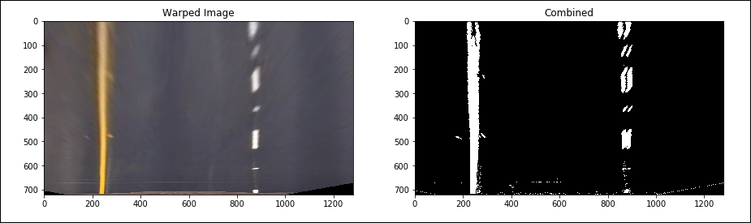
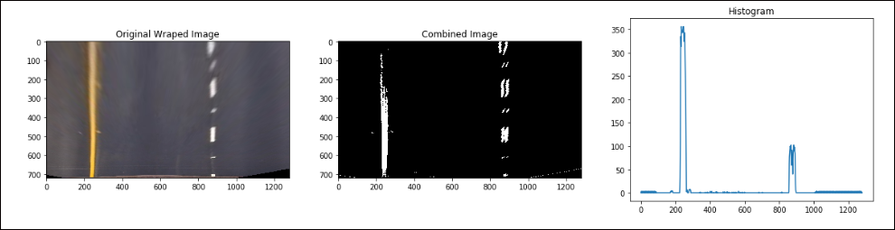
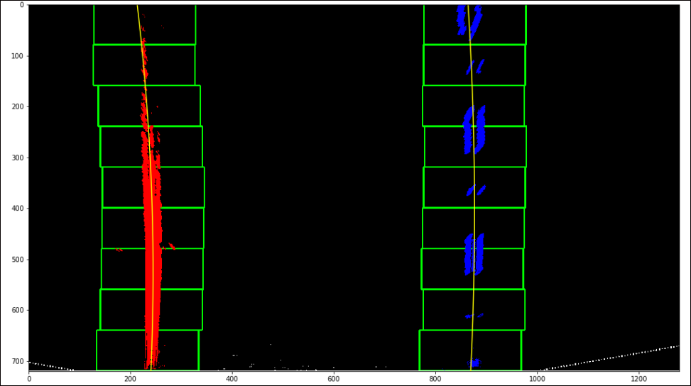
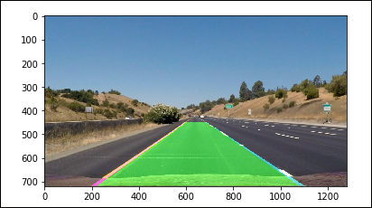

## Advanced Lane Finding
*initial commit with camera matrix code*
 - Draw chess corners and get the camera matrix
 - output the chesscorners on one image
 - 

*Added src and dst points*
 - Tuned the src and dst points 
 - Printed out on a curved and straight line. Looks decent
 - cleaned up the warped image implementation
 - 

*Straight lines in the image output*
 - Added the sobel and color transform
 - wrapped and applied transforms
 - Checked the output of image after transforms
 - straight lines coming out
 - 

*Added histogram function*
 - Added histgram function and output it
 - 

*line find and fit polynomial functions*
 - Added sliding window function and visualized outputs
 - fit lines to them
 - 

*unwrap and draw lines*
 - Unrwap the image and draw the lines on them
 - fill the ploygon area for visualization
 - 

